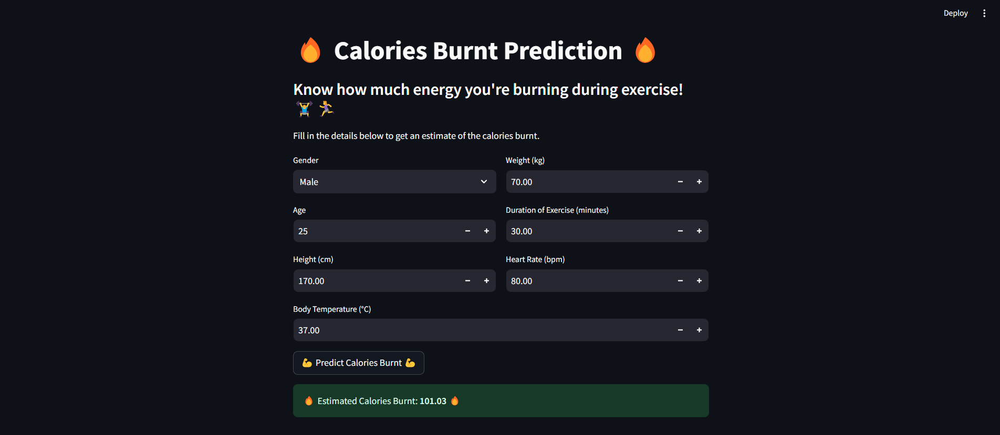

# Calories Burnt Prediction App 🔥

This app predicts the calories burnt during exercise using an advanced machine learning model. Built with:
- **Streamlit** for the frontend.
- **XGBoost** for the prediction model.

## Features
- User-friendly dashboard.
- Input fields for gender, age, weight, height, and exercise details.
- Instant calorie prediction.

## Screenshot
Here’s a screenshot of the app in action:



## Installation
1. Clone the repository:
    ```bash
    git clone https://github.com/AlgoAnurag/calorie-predictor.git
    ```

2. Navigate to the folder and create a virtual environment:
    ```bash
    python -m venv venv
    ```

3. Install dependencies:
    ```bash
    pip install -r requirements.txt
    ```

4. Run the app:
    ```bash
    streamlit run main.py
    ```

